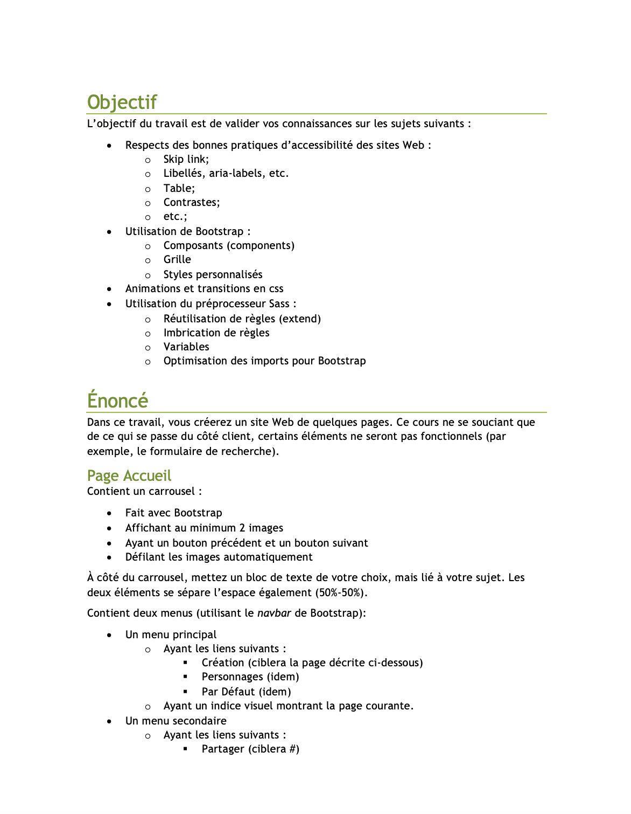
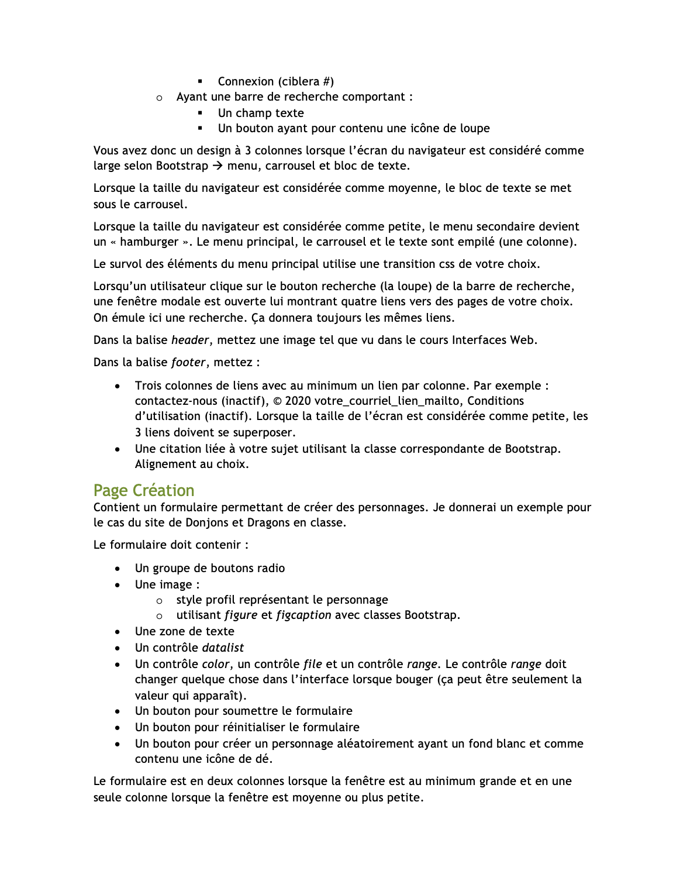
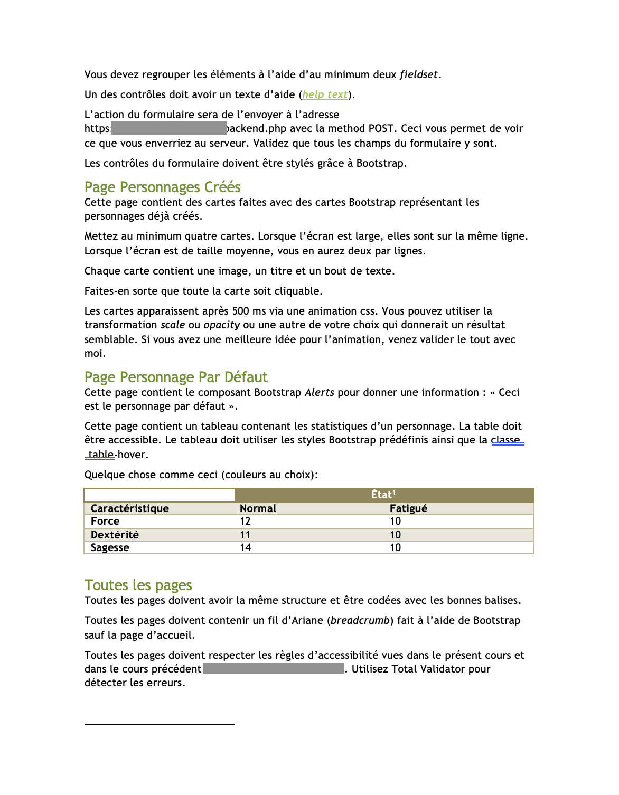
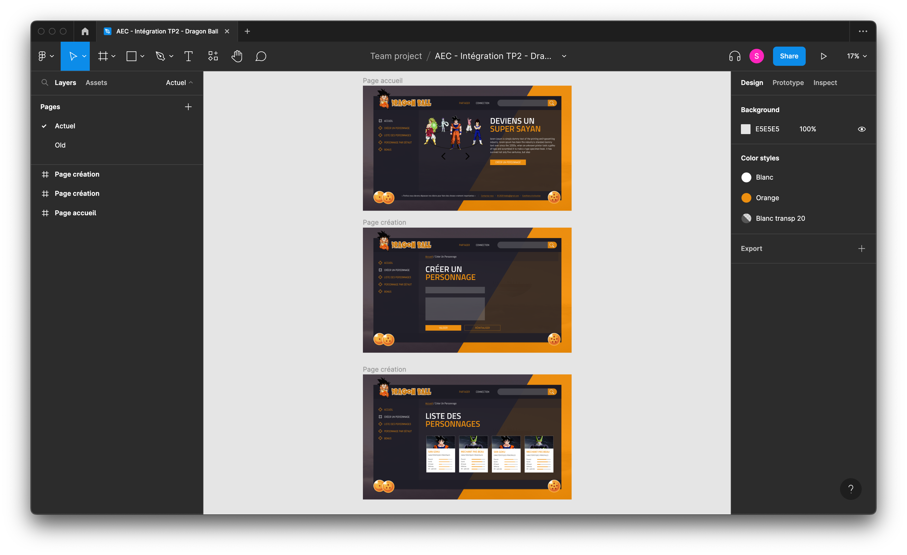

# Description 

Projet réalisé en groupe de 3 dans le cadre de mon AEC en développement web. 

L’objectif du travail était de créer un petit site avec les instructions suivantes : 

Je me suis, entre autres, occupée du graphisme du site et du développement de sa structure principale.    

## Table des matières

1. [Visuels](#visuels)
2. [Prototype Figma](#prototype-figma)
3. [Démonstration du projet](#démonstration-du-projet)

# Visuels

# Prototype Figma 

[Consulter le prototype Figma du projet](https://www.figma.com/proto/Eek6LGy5nP9Aa154Lu711p/AEC---Int%C3%A9gration-TP2---Dragon-Ball?page-id=0%3A1&node-id=22%3A183&viewport=-246%2C-371%2C0.17&scaling=min-zoom)

# Démonstration du projet 

[Consulter le projet sur mon site web personnel (lien à venir)](#)